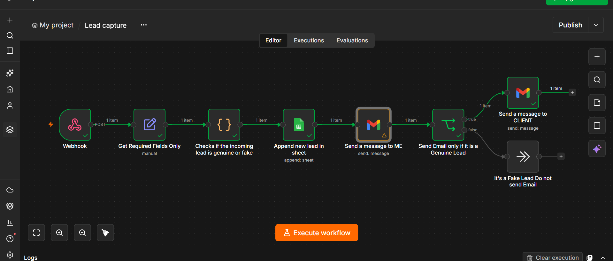
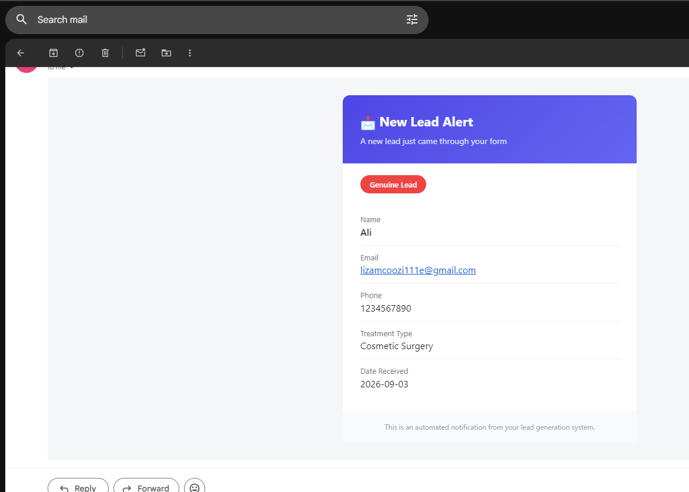
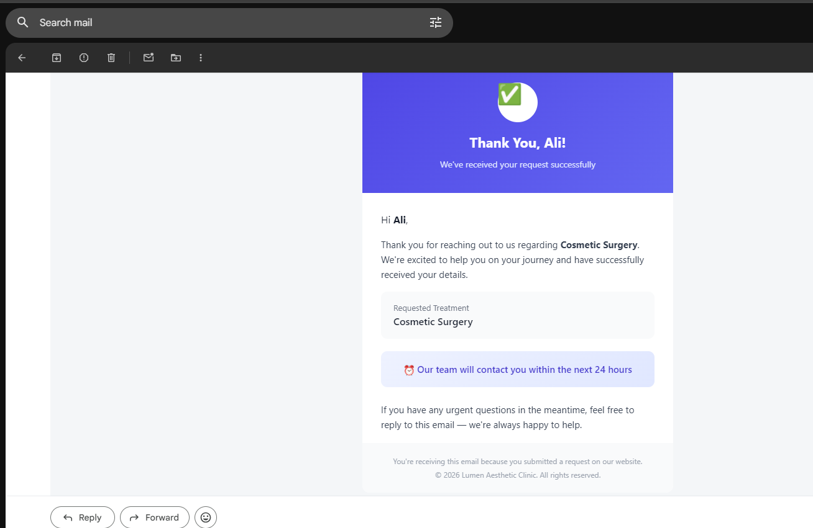
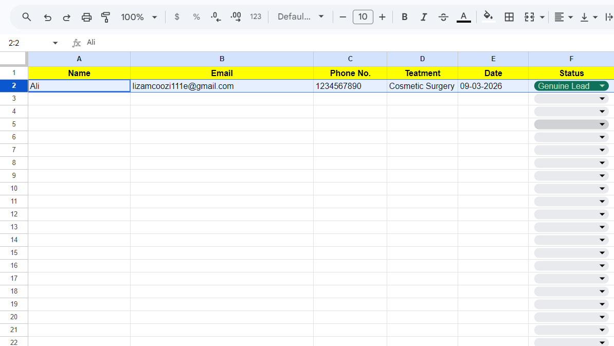

# Lead Generation Automation — n8n Workflow

An automated lead pipeline built with n8n that captures leads via webhook, filters out fake submissions, logs every entry to Google Sheets, and sends branded HTML email notifications to both admin and genuine clients.

---

## What It Does

```
Lead submitted via web form
            ↓
   Fields extracted & cleaned
            ↓
  Validate email & phone number
            ↓
      ┌─────┴─────┐
   Genuine       Fake
      ↓             ↓
Google Sheets    Google Sheets
   logged           logged
      ↓
  Admin email
  sent instantly
      ↓
  Client confirmation
  email sent
```

**No spam. No fake leads. Every submission tracked automatically.**

---

## What Gets Validated

| Check | Rule |
|---|---|
| Email format | Must match valid regex pattern |
| Fake email patterns | Blocks `test`, `fake`, `example`, `asdf`, `xyz` |
| Repeated characters | Blocks `aaaa@aaaa.com` style inputs |
| Phone length | Must be 10–15 digits |
| Repeated digits | Blocks `1111111111` style numbers |
| Sequential digits | Blocks `1234567890` / `0987654321` |

---

## Tech Stack

| Tool | Purpose |
|---|---|
| n8n | Workflow automation |
| JavaScript (Code node) | Lead validation logic |
| Google Sheets | Lead logging (genuine + fake) |
| Gmail | Admin alert + client confirmation email |

---

## Workflow Overview

```
[Webhook] → [Extract Fields] → [Validate Lead] → [Google Sheets]
                                               ↓
                                         [Admin Email]
                                               ↓
                              ┌────────────────┴────────────────┐
                           Genuine                             Fake
                              ↓                                  ↓
                      [Client Email]                         [No Email]
```

**7 nodes. Fully automated. Runs 24/7.**

---

## Setup

### 1. Import Workflow

Open n8n → **Import from file** → select `workflow.json`

### 2. Add Credentials

| Credential | Where to get |
|---|---|
| Gmail OAuth2 | Google Cloud Console |
| Google Sheets OAuth2 | Google Cloud Console |

### 3. Configure Nodes

**Google Sheets node:**
- Create a sheet with these columns:

```
Name | Email | Phone No. | Treatment | Date | Status
```

- Copy the Sheet ID from the URL and paste it in the node

**Admin email node:**
- Update `sendTo` with your email address
- Update sender name to your clinic/business name

**Client email node:**
- Update sender name and footer text to match your brand

### 4. Activate

Toggle the workflow **Active** in n8n → point your contact form to the webhook URL → done.

---

## Webhook Payload

Send a `POST` request with this JSON body:

```json
{
  "name": "Sarah Johnson",
  "email": "sarah@example.com",
  "phone": "+923001234567",
  "treatmentType": "Laser Hair Removal"
}
```

---

## Screenshots









---

## Use Cases

- **Clinics & salons** — capture and qualify treatment enquiries automatically
- **Service businesses** — filter bot/spam submissions before they reach your CRM
- **Freelancers** — automate client intake without manual checking
- **Agencies** — drop into any client lead gen stack in minutes

---

## License

MIT — free to use and modify.
